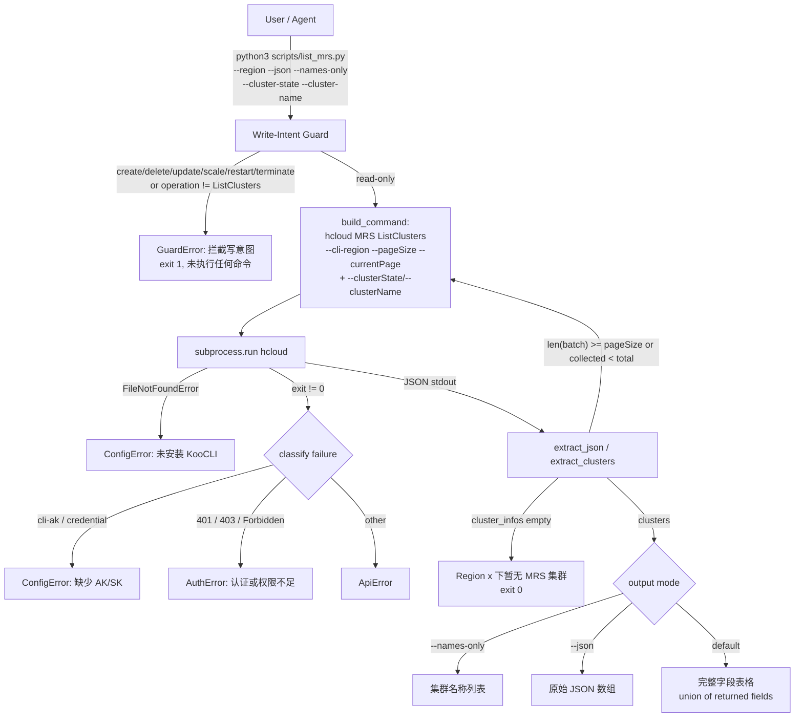

# Data Flow Diagram

```mermaid
flowchart TD
    A[User / Agent] -->|"python3 scripts/list_mrs.py<br/>--region --json --names-only<br/>--cluster-state --cluster-name"| B[Write-Intent Guard]
    B -->|"create/delete/update/scale/restart/terminate<br/>or operation != ListClusters"| G[GuardError: 拦截写意图<br/>exit 1, 未执行任何命令]
    B -->|read-only| C[build_command:<br/>hcloud MRS ListClusters<br/>--cli-region --pageSize --currentPage<br/>+ --clusterState/--clusterName]
    C --> D[subprocess.run hcloud]
    D -->|FileNotFoundError| E1[ConfigError: 未安装 KooCLI]
    D -->|exit != 0| E2{classify failure}
    E2 -->|"cli-ak / credential"| E3[ConfigError: 缺少 AK/SK]
    E2 -->|"401 / 403 / Forbidden"| E4[AuthError: 认证或权限不足]
    E2 -->|other| E5[ApiError]
    D -->|JSON stdout| F[extract_json / extract_clusters]
    F -->|"cluster_infos" empty| H["Region x 下暂无 MRS 集群<br/>exit 0"]
    F -->|clusters| I{"output mode"}
    I -->|--names-only| J[集群名称列表]
    I -->|--json| K[原始 JSON 数组]
    I -->|default| L[完整字段表格<br/>union of returned fields]
    F -->|"len(batch) >= pageSize or collected < total"| C
```
