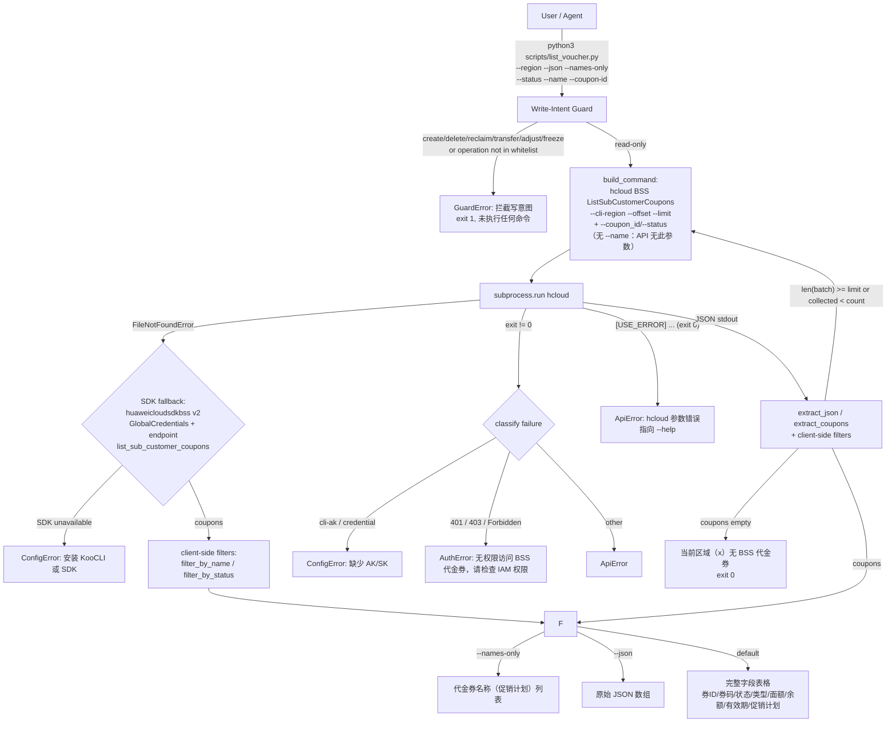

# Data Flow Diagram

```mermaid
flowchart TD
    A[User / Agent] -->|"python3 scripts/list_voucher.py<br/>--region --json --names-only<br/>--status --name --coupon-id"| B[Write-Intent Guard]
    B -->|"create/delete/reclaim/transfer/adjust/freeze<br/>or operation not in whitelist"| G[GuardError: 拦截写意图<br/>exit 1, 未执行任何命令]
    B -->|read-only| C[build_command:<br/>hcloud BSS ListSubCustomerCoupons<br/>--cli-region --offset --limit<br/>+ --coupon_id/--status<br/>（无 --name：API 无此参数）]
    C --> D[subprocess.run hcloud]
    D -->|FileNotFoundError| F1{SDK fallback:<br/>huaweicloudsdkbss v2<br/>GlobalCredentials + endpoint<br/>list_sub_customer_coupons}
    F1 -->|SDK unavailable| E1[ConfigError: 安装 KooCLI 或 SDK]
    F1 -->|coupons| FS[client-side filters:<br/>filter_by_name / filter_by_status]
    D -->|"exit != 0"| E2{classify failure}
    E2 -->|"cli-ak / credential"| E3[ConfigError: 缺少 AK/SK]
    E2 -->|"401 / 403 / Forbidden"| E4[AuthError: 无权限访问 BSS 代金券，请检查 IAM 权限]
    E2 -->|"other"| E5[ApiError]
    D -->|"[USE_ERROR] ... (exit 0)"| E6[ApiError: hcloud 参数错误<br/>指向 --help]
    D -->|JSON stdout| F2[extract_json / extract_coupons<br/>+ client-side filters]
    FS --> F
    F2 -->|"coupons" empty| H["当前区域（x）无 BSS 代金券<br/>exit 0"]
    F2 -->|coupons| F
    F -->|--names-only| J[代金券名称（促销计划）列表]
    F -->|--json| K[原始 JSON 数组]
    F -->|default| L[完整字段表格<br/>券ID/券码/状态/类型/面额/余额/有效期/促销计划]
    F2 -->|"len(batch) >= limit or collected < count"| C
```
