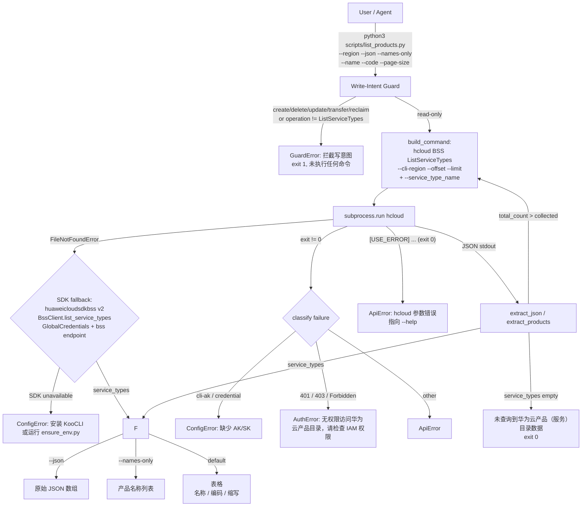

# Data Flow Diagram

```mermaid
flowchart TD
    A[User / Agent] -->|"python3 scripts/list_products.py<br/>--region --json --names-only<br/>--name --code --page-size"| B[Write-Intent Guard]
    B -->|"create/delete/update/transfer/reclaim<br/>or operation != ListServiceTypes"| G[GuardError: 拦截写意图<br/>exit 1, 未执行任何命令]
    B -->|read-only| C[build_command:<br/>hcloud BSS ListServiceTypes<br/>--cli-region --offset --limit<br/>+ --service_type_name]
    C --> D[subprocess.run hcloud]
    D -->|FileNotFoundError| F1{SDK fallback:<br/>huaweicloudsdkbss v2<br/>BssClient.list_service_types<br/>GlobalCredentials + bss endpoint}
    F1 -->|SDK unavailable| E1[ConfigError: 安装 KooCLI 或运行 ensure_env.py]
    F1 -->|service_types| F
    D -->|"exit != 0"| E2{classify failure}
    E2 -->|"cli-ak / credential"| E3[ConfigError: 缺少 AK/SK]
    E2 -->|"401 / 403 / Forbidden"| E4[AuthError: 无权限访问华为云产品目录，请检查 IAM 权限]
    E2 -->|"other"| E5[ApiError]
    D -->|"[USE_ERROR] ... (exit 0)"| E6[ApiError: hcloud 参数错误<br/>指向 --help]
    D -->|JSON stdout| F2[extract_json / extract_products]
    F2 -->|"service_types empty"| H["未查询到华为云产品（服务）目录数据<br/>exit 0"]
    F2 -->|service_types| F
    F -->|--json| K[原始 JSON 数组]
    F -->|--names-only| J[产品名称列表]
    F -->|default| L[表格<br/>名称 / 编码 / 缩写]
    F2 -->|"total_count > collected"| C
```