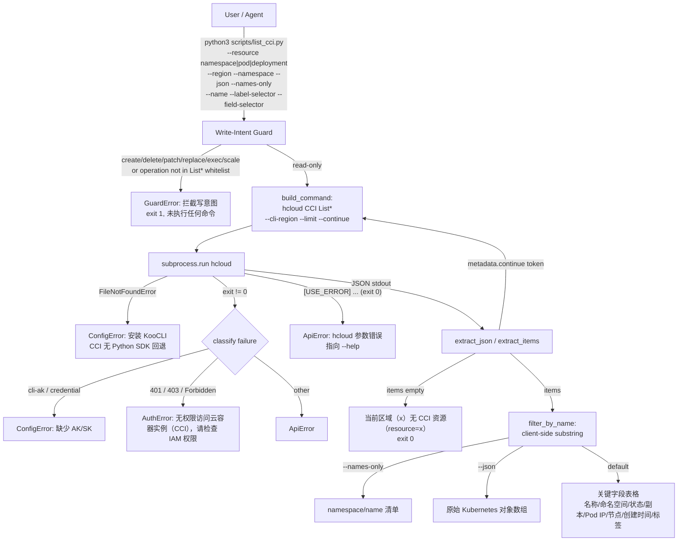

# Data Flow Diagram

```mermaid
flowchart TD
    A[User / Agent] -->|"python3 scripts/list_cci.py<br/>--resource namespace|pod|deployment<br/>--region --namespace --json --names-only<br/>--name --label-selector --field-selector"| B[Write-Intent Guard]
    B -->|"create/delete/patch/replace/exec/scale<br/>or operation not in List* whitelist"| G[GuardError: 拦截写意图<br/>exit 1, 未执行任何命令]
    B -->|read-only| C[build_command:<br/>hcloud CCI List*<br/>--cli-region --limit --continue]
    C --> D[subprocess.run hcloud]
    D -->|FileNotFoundError| E1[ConfigError: 安装 KooCLI<br/>CCI 无 Python SDK 回退]
    D -->|"exit != 0"| E2{classify failure}
    E2 -->|"cli-ak / credential"| E3[ConfigError: 缺少 AK/SK]
    E2 -->|"401 / 403 / Forbidden"| E4[AuthError: 无权限访问云容器实例（CCI），请检查 IAM 权限]
    E2 -->|"other"| E5[ApiError]
    D -->|"[USE_ERROR] ... (exit 0)"| E6[ApiError: hcloud 参数错误<br/>指向 --help]
    D -->|JSON stdout| F2[extract_json / extract_items]
    F2 -->|"metadata.continue token"| C
    F2 -->|"items empty"| H["当前区域（x）无 CCI 资源（resource=x）<br/>exit 0"]
    F2 -->|items| F[filter_by_name:<br/>client-side substring]
    F -->|--names-only| J[namespace/name 清单]
    F -->|--json| K[原始 Kubernetes 对象数组]
    F -->|default| L[关键字段表格<br/>名称/命名空间/状态/副本/Pod IP/节点/创建时间/标签]
```