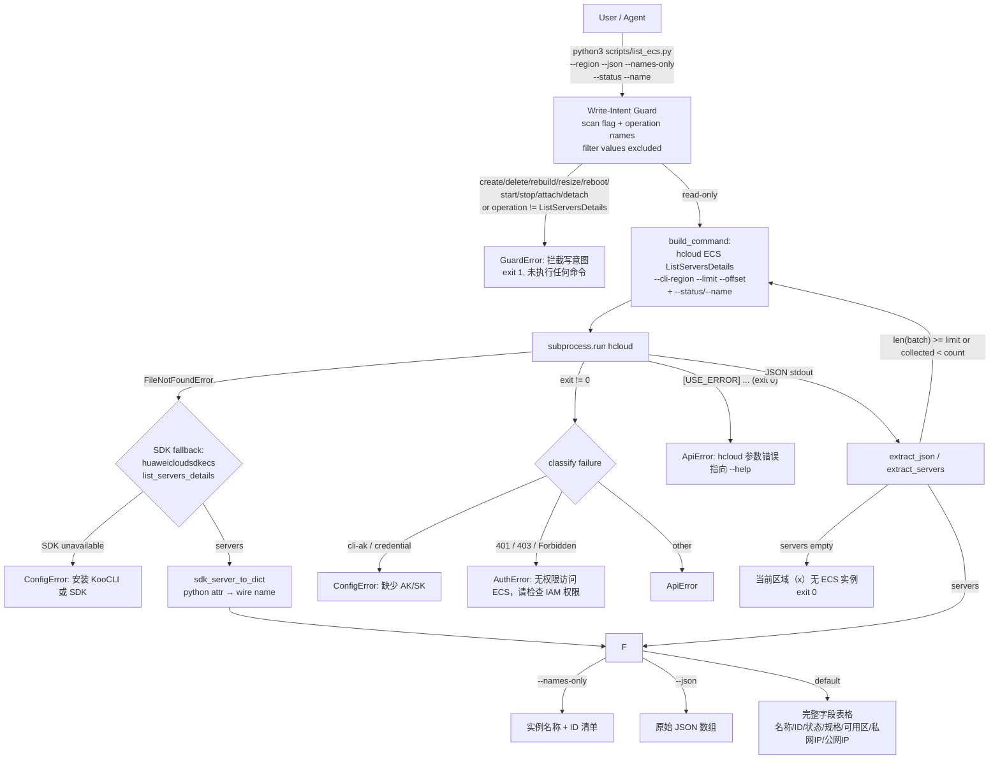

# Data Flow Diagram

```mermaid
flowchart TD
    A[User / Agent] -->|"python3 scripts/list_ecs.py<br/>--region --json --names-only<br/>--status --name"| B[Write-Intent Guard<br/>scan flag + operation names<br/>filter values excluded]
    B -->|"create/delete/rebuild/resize/reboot/<br/>start/stop/attach/detach<br/>or operation != ListServersDetails"| G[GuardError: 拦截写意图<br/>exit 1, 未执行任何命令]
    B -->|read-only| C[build_command:<br/>hcloud ECS ListServersDetails<br/>--cli-region --limit --offset<br/>+ --status/--name]
    C --> D[subprocess.run hcloud]
    D -->|FileNotFoundError| F1{SDK fallback:<br/>huaweicloudsdkecs<br/>list_servers_details}
    F1 -->|SDK unavailable| E1[ConfigError: 安装 KooCLI 或 SDK]
    F1 -->|servers| FS[sdk_server_to_dict<br/>python attr → wire name]
    FS --> F
    D -->|"exit != 0"| E2{classify failure}
    E2 -->|"cli-ak / credential"| E3[ConfigError: 缺少 AK/SK]
    E2 -->|"401 / 403 / Forbidden"| E4[AuthError: 无权限访问 ECS，请检查 IAM 权限]
    E2 -->|"other"| E5[ApiError]
    D -->|"[USE_ERROR] ... (exit 0)"| E6[ApiError: hcloud 参数错误<br/>指向 --help]
    D -->|JSON stdout| F2[extract_json / extract_servers]
    F2 -->|"servers empty"| H["当前区域（x）无 ECS 实例<br/>exit 0"]
    F2 -->|servers| F
    F -->|--names-only| J[实例名称 + ID 清单]
    F -->|--json| K[原始 JSON 数组]
    F -->|default| L[完整字段表格<br/>名称/ID/状态/规格/可用区/私网IP/公网IP]
    F2 -->|"len(batch) >= limit or collected < count"| C
```
