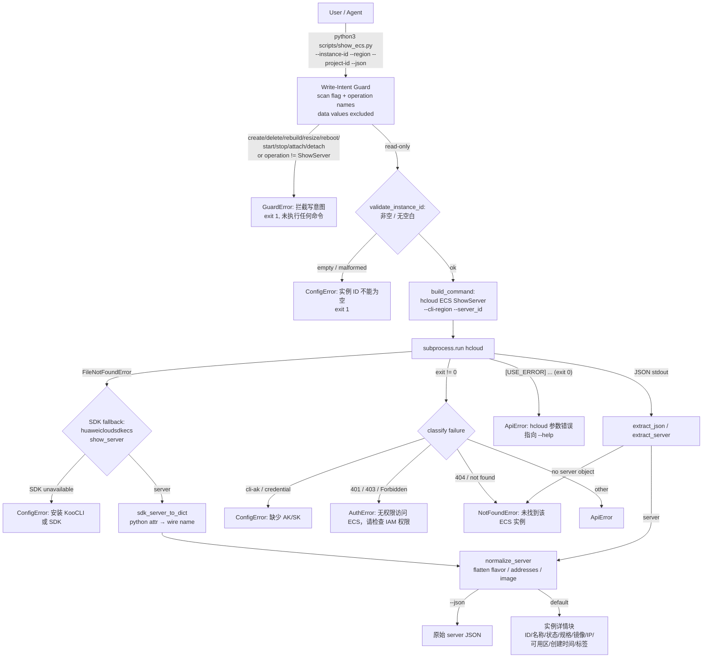

# Data Flow Diagram

```mermaid
flowchart TD
    A[User / Agent] -->|"python3 scripts/show_ecs.py<br/>--instance-id --region --project-id --json"| B[Write-Intent Guard<br/>scan flag + operation names<br/>data values excluded]
    B -->|"create/delete/rebuild/resize/reboot/<br/>start/stop/attach/detach<br/>or operation != ShowServer"| G[GuardError: 拦截写意图<br/>exit 1, 未执行任何命令]
    B -->|read-only| V{validate_instance_id:<br/>非空 / 无空白}
    V -->|empty / malformed| E0[ConfigError: 实例 ID 不能为空<br/>exit 1]
    V -->|ok| C[build_command:<br/>hcloud ECS ShowServer<br/>--cli-region --server_id]
    C --> D[subprocess.run hcloud]
    D -->|FileNotFoundError| F1{SDK fallback:<br/>huaweicloudsdkecs<br/>show_server}
    F1 -->|SDK unavailable| E1[ConfigError: 安装 KooCLI 或 SDK]
    F1 -->|server| FS[sdk_server_to_dict<br/>python attr → wire name]
    FS --> F
    D -->|"exit != 0"| E2{classify failure}
    E2 -->|"cli-ak / credential"| E3[ConfigError: 缺少 AK/SK]
    E2 -->|"401 / 403 / Forbidden"| E4[AuthError: 无权限访问 ECS，请检查 IAM 权限]
    E2 -->|"404 / not found"| E5[NotFoundError: 未找到该 ECS 实例]
    E2 -->|"other"| E6[ApiError]
    D -->|"[USE_ERROR] ... (exit 0)"| E7[ApiError: hcloud 参数错误<br/>指向 --help]
    D -->|JSON stdout| F2[extract_json / extract_server]
    F2 -->|"no server object"| E5
    F2 -->|server| F[normalize_server<br/>flatten flavor / addresses / image]
    F -->|--json| K[原始 server JSON]
    F -->|default| L[实例详情块<br/>ID/名称/状态/规格/镜像/IP/可用区/创建时间/标签]
```