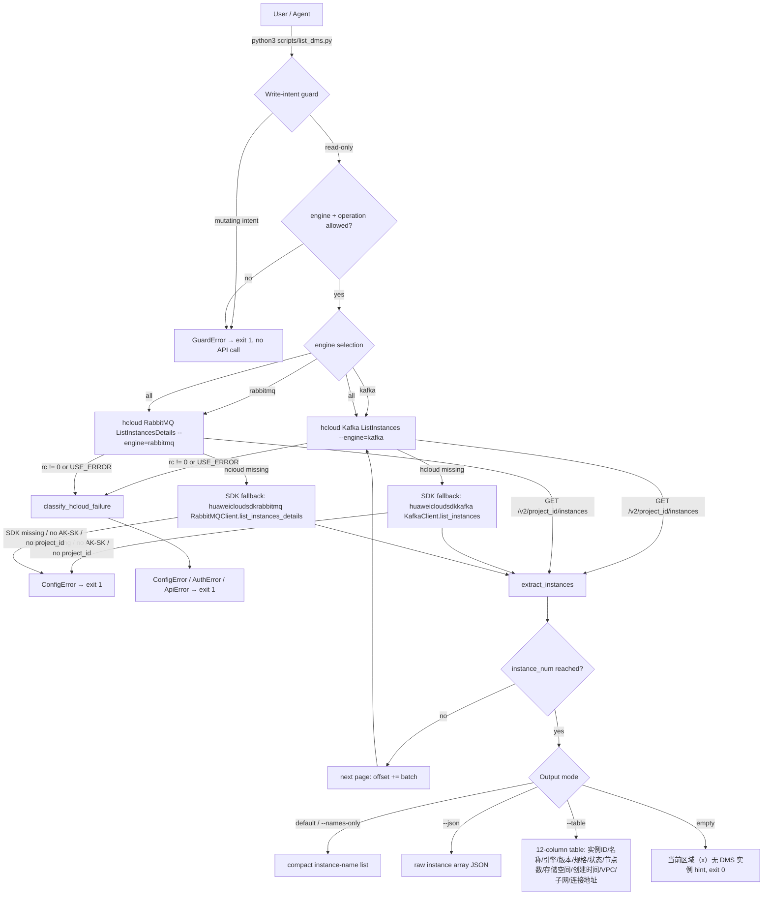

# Data Flow Diagram

```mermaid
flowchart TD
    A[User / Agent] -->|python3 scripts/list_dms.py| B{Write-intent guard}
    B -->|mutating intent| X[GuardError → exit 1, no API call]
    B -->|read-only| C{engine + operation allowed?}
    C -->|no| X
    C -->|yes| D{engine selection}

    D -->|kafka| E[hcloud Kafka ListInstances --engine=kafka]
    D -->|rabbitmq| F[hcloud RabbitMQ ListInstancesDetails --engine=rabbitmq]
    D -->|all| E
    D -->|all| F

    E -->|hcloud missing| G[SDK fallback: huaweicloudsdkkafka KafkaClient.list_instances]
    F -->|hcloud missing| H[SDK fallback: huaweicloudsdkrabbitmq RabbitMQClient.list_instances_details]
    G -->|SDK missing / no AK-SK / no project_id| Y[ConfigError → exit 1]
    H -->|SDK missing / no AK-SK / no project_id| Y

    E -->|rc != 0 or USE_ERROR| I[classify_hcloud_failure]
    F -->|rc != 0 or USE_ERROR| I
    I --> J[ConfigError / AuthError / ApiError → exit 1]

    E -->|GET /v2/project_id/instances| K[extract_instances]
    F -->|GET /v2/project_id/instances| K
    G --> K
    H --> K

    K --> L{instance_num reached?}
    L -->|no| M[next page: offset += batch]
    M --> E
    L -->|yes| N{Output mode}
    N -->|default / --names-only| O[compact instance-name list]
    N -->|--json| P[raw instance array JSON]
    N -->|--table| Q[12-column table: 实例ID/名称/引擎/版本/规格/状态/节点数/存储空间/创建时间/VPC/子网/连接地址]
    N -->|empty| R[当前区域（x）无 DMS 实例 hint, exit 0]
```