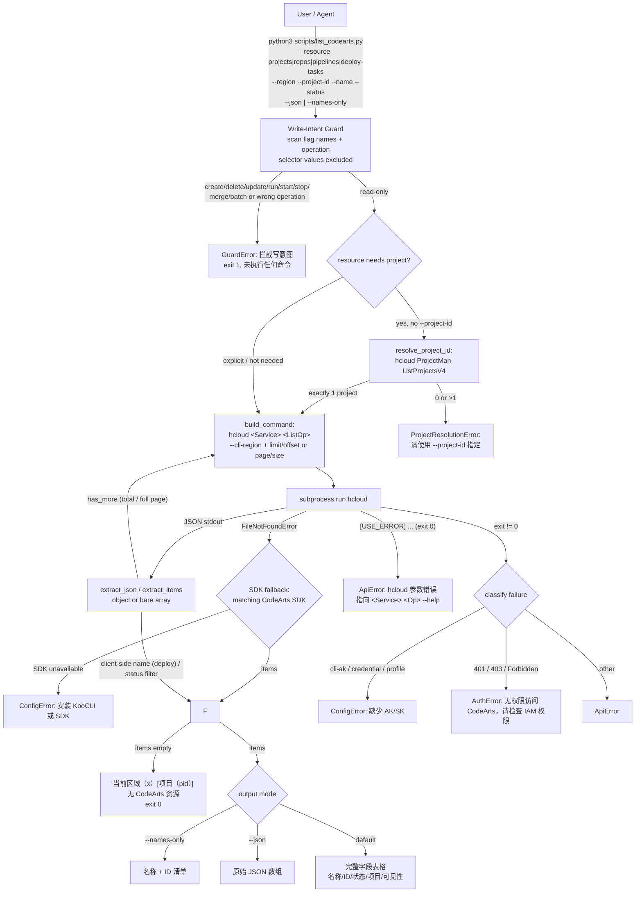

# Data Flow Diagram

```mermaid
flowchart TD
    A[User / Agent] -->|"python3 scripts/list_codearts.py<br/>--resource projects|repos|pipelines|deploy-tasks<br/>--region --project-id --name --status<br/>--json | --names-only"| B[Write-Intent Guard<br/>scan flag names + operation<br/>selector values excluded]
    B -->|"create/delete/update/run/start/stop/<br/>merge/batch or wrong operation"| G[GuardError: 拦截写意图<br/>exit 1, 未执行任何命令]
    B -->|read-only| R{resource needs project?}
    R -->|yes, no --project-id| RP[resolve_project_id:<br/>hcloud ProjectMan ListProjectsV4]
    RP -->|exactly 1 project| C
    RP -->|0 or >1| RE[ProjectResolutionError:<br/>请使用 --project-id 指定]
    R -->|explicit / not needed| C[build_command:<br/>hcloud &lt;Service&gt; &lt;ListOp&gt;<br/>--cli-region + limit/offset or page/size]
    C --> D[subprocess.run hcloud]
    D -->|FileNotFoundError| F1{SDK fallback:<br/>matching CodeArts SDK}
    F1 -->|SDK unavailable| E1[ConfigError: 安装 KooCLI 或 SDK]
    F1 -->|items| F
    D -->|"exit != 0"| E2{classify failure}
    E2 -->|"cli-ak / credential / profile"| E3[ConfigError: 缺少 AK/SK]
    E2 -->|"401 / 403 / Forbidden"| E4[AuthError: 无权限访问 CodeArts，请检查 IAM 权限]
    E2 -->|"other"| E5[ApiError]
    D -->|"[USE_ERROR] ... (exit 0)"| E6[ApiError: hcloud 参数错误<br/>指向 &lt;Service&gt; &lt;Op&gt; --help]
    D -->|JSON stdout| F2[extract_json / extract_items<br/>object or bare array]
    F2 -->|"client-side name (deploy) / status filter"| F
    F -->|"items empty"| H["当前区域（x）[项目（pid）]<br/>无 CodeArts 资源<br/>exit 0"]
    F -->|items| F3{output mode}
    F3 -->|--names-only| J[名称 + ID 清单]
    F3 -->|--json| K[原始 JSON 数组]
    F3 -->|default| L[完整字段表格<br/>名称/ID/状态/项目/可见性]
    F2 -->|"has_more (total / full page)"| C
```
