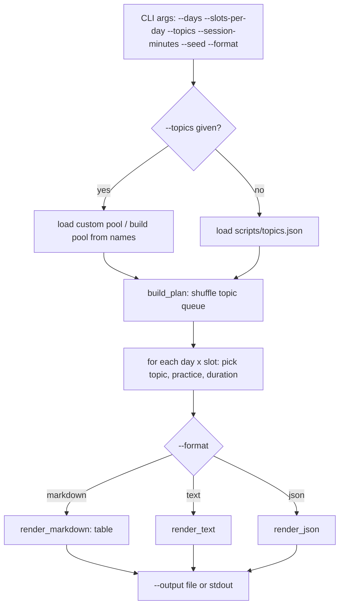

# Data Flow

```mermaid
flowchart TD
    A[CLI args: --days --slots-per-day --topics --session-minutes --seed --format] --> B{--topics given?}
    B -- yes --> C[load custom pool / build pool from names]
    B -- no --> D[load scripts/topics.json]
    C --> E[build_plan: shuffle topic queue]
    D --> E
    E --> F[for each day x slot: pick topic, practice, duration]
    F --> G{--format}
    G -- markdown --> H[render_markdown: table]
    G -- text --> I[render_text]
    G -- json --> J[render_json]
    H --> K[--output file or stdout]
    I --> K
    J --> K
```

All randomness is driven by a single `random.Random(seed)`, so a fixed `--seed` makes the
whole pipeline deterministic.