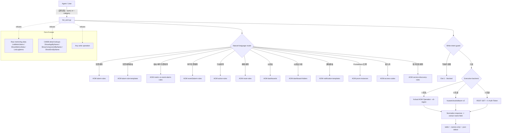

# Data Flow Diagram

```mermaid
flowchart TD
    U[Agent / User] -->|"自然语言 --query or --category"| P[list_aom.py]
    P --> R{Natural-language router}
    R -->|告警规则| C1[AOM alarm-rules]
    R -->|告警规则模板| C2[AOM alarm-rule-templates]
    R -->|指标/事件告警规则| C3[AOM metric-or-event-alarm-rules]
    R -->|事件告警规则| C4[AOM event2alarm-rules]
    R -->|行动规则| C5[AOM action-rules]
    R -->|静默规则| C6[AOM mute-rules]
    R -->|仪表盘| C7[AOM dashboards]
    R -->|仪表盘分组| C8[AOM dashboard-folders]
    R -->|通知模板| C9[AOM notification-templates]
    R -->|Prometheus 实例| C10[AOM prom-instances]
    R -->|接入码| C11[AOM access-codes]
    R -->|服务发现规则| C12[AOM service-discovery-rules]

    P --> G{Write-intent guard}
    G -->|写操作意图| X[Exit 1 - blocked]
    G -->|只读| B{Execution backend}

    B -->|1 优先| CLI[hcloud AOM Operation --cli-region]
    B -->|2 回退| SDK[huaweicloudsdkaom v2]
    B -->|3 回退| REST[REST GET + X-Auth-Token]

    CLI --> N[Normalize response -> extract name field]
    SDK --> N
    REST --> N
    N --> O["table / --names-only / --json stdout"]

    subgraph Out of scope
      MD[Raw metric/log data ListMetricItems / ShowMetricsData / ListLogItems]
      CMDB[CMDB detail lookups ShowAppByName / ShowComponentByName / ShowEnvByName]
      W[Any write operation]
    end
    P -.refuses.-> MD
    P -.refuses.-> CMDB
    P -.refuses.-> W
```