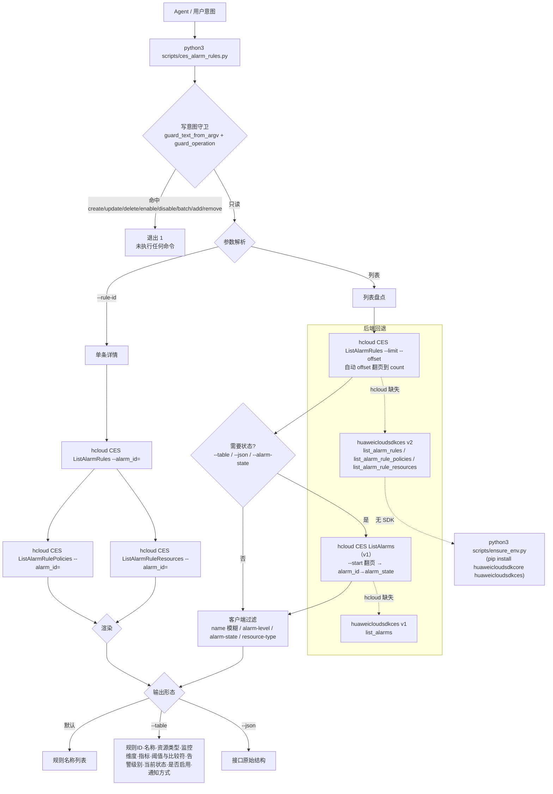

# 数据流图 — huawei-cloud-ces-alarm-rules-list

```mermaid
flowchart TD
    A[Agent / 用户意图] --> B["python3 scripts/ces_alarm_rules.py"]
    B --> C{写意图守卫<br/>guard_text_from_argv + guard_operation}
    C -- 命中 create/update/delete/enable/disable/batch/add/remove --> X[退出 1<br/>未执行任何命令]
    C -- 只读 --> D{参数解析}

    D -- "--rule-id" --> E[单条详情]
    D -- 列表 --> F[列表盘点]

    E --> E1["hcloud CES ListAlarmRules --alarm_id=<id>"]
    E1 --> E2["hcloud CES ListAlarmRulePolicies --alarm_id=<id>"]
    E1 --> E3["hcloud CES ListAlarmRuleResources --alarm_id=<id>"]
    E2 --> E4{渲染}
    E3 --> E4

    F --> F1["hcloud CES ListAlarmRules --limit --offset<br/>自动 offset 翻页到 count"]
    F1 --> F2{需要状态?<br/>--table / --json / --alarm-state}
    F2 -- 是 --> F3["hcloud CES ListAlarms（v1）<br/>--start 翻页 → alarm_id→alarm_state"]
    F2 -- 否 --> G
    F3 --> G[客户端过滤<br/>name 模糊 / alarm-level / alarm-state / resource-type]
    G --> H{输出形态}
    H -- 默认 --> H1[规则名称列表]
    H -- "--table" --> H2[规则ID·名称·资源类型·监控维度·指标·阈值与比较符·告警级别·当前状态·是否启用·通知方式]
    H -- "--json" --> H3[接口原始结构]

    E4 --> H

    subgraph 后端回退
        F1 -. hcloud 缺失 .-> S1["huaweicloudsdkces v2<br/>list_alarm_rules / list_alarm_rule_policies / list_alarm_rule_resources"]
        F3 -. hcloud 缺失 .-> S2["huaweicloudsdkces v1<br/>list_alarms"]
    end

    S1 -. 无 SDK .-> ENV["python3 scripts/ensure_env.py<br/>(pip install huaweicloudsdkcore huaweicloudsdkces)"]
```

只读边界：图中所有云端调用都是 GET（`ListAlarmRules` / `ListAlarmRulePolicies` /
`ListAlarmRuleResources` / `ListAlarms`），没有任何写回路径。