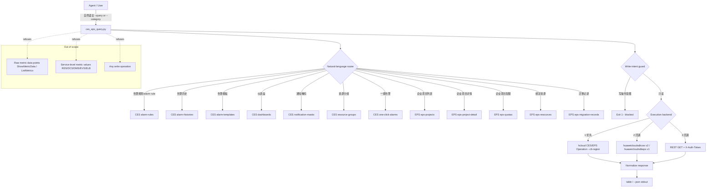

# Data Flow Diagram

```mermaid
flowchart TD
    U[Agent / User] -->|"自然语言 --query or --category"| P[ces_eps_query.py]
    P --> R{Natural-language router}
    R -->|告警规则/alarm rule| C1[CES alarm-rules]
    R -->|告警历史| C2[CES alarm-histories]
    R -->|告警模板| C3[CES alarm-templates]
    R -->|仪表盘| C4[CES dashboards]
    R -->|通知掩码| C5[CES notification-masks]
    R -->|资源分组| C6[CES resource-groups]
    R -->|一键告警| C7[CES one-click-alarms]
    R -->|企业项目列表| E1[EPS eps-projects]
    R -->|企业项目详情| E2[EPS eps-project-detail]
    R -->|企业项目配额| E3[EPS eps-quotas]
    R -->|绑定资源| E4[EPS eps-resources]
    R -->|迁移记录| E5[EPS eps-migration-records]

    P --> G{Write-intent guard}
    G -->|写操作意图| X[Exit 1 - blocked]
    G -->|只读| B{Execution backend}

    B -->|1 优先| CLI[hcloud CES/EPS Operation --cli-region]
    B -->|2 回退| SDK[huaweicloudsdkces v2 / huaweicloudsdkeps v1]
    B -->|3 回退| REST[REST GET + X-Auth-Token]

    CLI --> N[Normalize response]
    SDK --> N
    REST --> N
    N --> O["table / --json stdout"]

    subgraph Out of scope
      MD[Raw metric data points ShowMetricData / ListMetrics]
      SL[Service-level metric values RDS/DCS/DMS/EVS/ELB]
      W[Any write operation]
    end
    P -.refuses.-> MD
    P -.refuses.-> SL
    P -.refuses.-> W
```