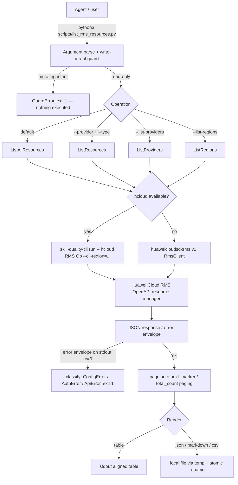

# Data Flow — huawei-cloud-rms-list

```mermaid
flowchart TD
    A[Agent / user] -->|python3 scripts/list_rms_resources.py| B[Argument parse + write-intent guard]
    B -->|mutating intent| Z[GuardError, exit 1 — nothing executed]
    B -->|read-only| C{Operation}
    C -->|default| D[ListAllResources]
    C -->|--provider + --type| E[ListResources]
    C -->|--list-providers| F[ListProviders]
    C -->|--list-regions| G[ListRegions]

    D --> H{hcloud available?}
    E --> H
    F --> H
    G --> H

    H -->|yes| I[skill-quality-cli run -- hcloud RMS Op --cli-region=...]
    I --> J[Huawei Cloud RMS OpenAPI resource-manager]
    H -->|no| K[huaweicloudsdkrms v1 RmsClient]
    K --> J

    J --> L[JSON response / error envelope]
    L -->|error envelope on stdout rc=0| M[classify: ConfigError / AuthError / ApiError, exit 1]
    L -->|ok| N[page_info.next_marker / total_count paging]
    N --> O{Render}
    O -->|table| P[stdout aligned table]
    O -->|json / markdown / csv| Q[local file via temp + atomic rename]
```

Read-only guarantee: no branch constructs a mutating RMS operation, and the
export writes only to the local filesystem.
