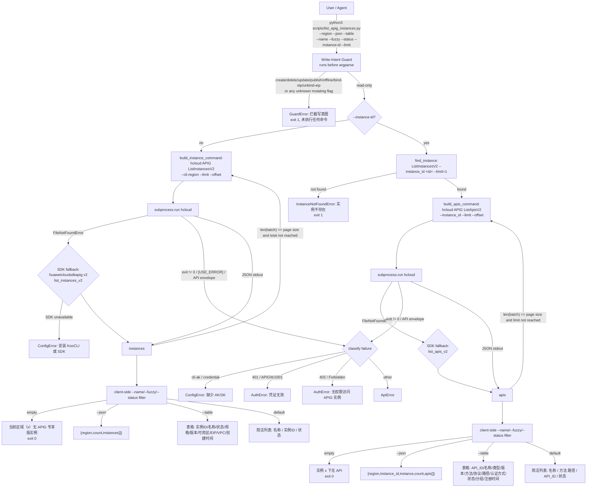

# Data Flow Diagram

```mermaid
flowchart TD
    A[User / Agent] -->|"python3 scripts/list_apig_instances.py<br/>--region --json --table<br/>--name --fuzzy --status --instance-id --limit"| B[Write-Intent Guard<br/>runs before argparse]
    B -->|"create/delete/update/publish/offline/bind-eip/unbind-eip<br/>or any unknown mutating flag"| G[GuardError: 拦截写意图<br/>exit 1, 未执行任何命令]
    B -->|read-only| Q{--instance-id?}

    Q -->|no| C1[build_instance_command:<br/>hcloud APIG ListInstancesV2<br/>--cli-region --limit --offset]
    C1 --> D1[subprocess.run hcloud]
    D1 -->|FileNotFoundError| S1{SDK fallback:<br/>huaweicloudsdkapig v2<br/>list_instances_v2}
    D1 -->|"exit != 0 / [USE_ERROR] / API envelope"| E{classify failure}
    S1 -->|SDK unavailable| E1[ConfigError: 安装 KooCLI 或 SDK]
    S1 --> I1[instances]
    D1 -->|JSON stdout| I1

    I1 -->|"len(batch) == page size and total not reached"| C1
    I1 --> F1[client-side --name/--fuzzy/--status filter]
    F1 -->|empty| H1["当前区域（x）无 APIG 专享版实例<br/>exit 0"]
    F1 -->|--json| J1["{region,count,instances[]}"]
    F1 -->|--table| L1[表格: 实例ID/名称/状态/规格/版本/可用区/EIP/VPC/创建时间]
    F1 -->|default| K1[简洁列表: 名称 / 实例ID / 状态]

    Q -->|yes| V[find_instance:<br/>ListInstancesV2 --instance_id &lt;id&gt; --limit=1]
    V -->|not found| N[InstanceNotFoundError: 实例不存在<br/>exit 1]
    V -->|found| C2[build_apis_command:<br/>hcloud APIG ListApisV2<br/>--instance_id --limit --offset]
    C2 --> D2[subprocess.run hcloud]
    D2 -->|FileNotFoundError| S2{SDK fallback:<br/>list_apis_v2}
    D2 -->|"exit != 0 / API envelope"| E
    S2 --> I2[apis]
    D2 -->|JSON stdout| I2
    I2 -->|"len(batch) == page size and limit not reached"| C2
    I2 --> F2[client-side --name/--fuzzy/--status filter]
    F2 -->|empty| H2["实例 x 下无 API<br/>exit 0"]
    F2 -->|--json| J2["{region,instance_id,instance,count,apis[]}"]
    F2 -->|--table| L2[表格: API_ID/名称/类型/版本/方法/协议/路径/认证方式/状态/分组/注册时间]
    F2 -->|default| K2[简洁列表: 名称 / 方法 路径 / API_ID / 状态]

    E -->|"cli-ak / credential"| E2[ConfigError: 缺少 AK/SK]
    E -->|"401 / APIGW.0301"| E3[AuthError: 凭证无效]
    E -->|"403 / Forbidden"| E4[AuthError: 无权限访问 APIG 实例]
    E -->|other| E5[ApiError]
```