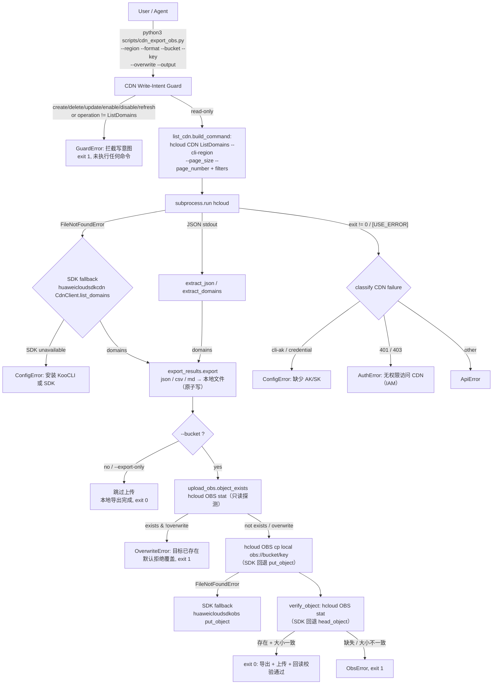

# Data Flow Diagram

```mermaid
flowchart TD
    A[User / Agent] -->|"python3 scripts/cdn_export_obs.py<br/>--region --format --bucket --key<br/>--overwrite --output"| B[CDN Write-Intent Guard]
    B -->|"create/delete/update/enable/disable/refresh<br/>or operation != ListDomains"| G[GuardError: 拦截写意图<br/>exit 1, 未执行任何命令]
    B -->|read-only| C["list_cdn.build_command:<br/>hcloud CDN ListDomains --cli-region<br/>--page_size --page_number + filters"]
    C --> D[subprocess.run hcloud]
    D -->|FileNotFoundError| F1{"SDK fallback<br/>huaweicloudsdkcdn CdnClient.list_domains"}
    F1 -->|SDK unavailable| E1[ConfigError: 安装 KooCLI 或 SDK]
    F1 -->|domains| X
    D -->|"exit != 0 / [USE_ERROR]"| E2{classify CDN failure}
    E2 -->|"cli-ak / credential"| E3[ConfigError: 缺少 AK/SK]
    E2 -->|"401 / 403"| E4["AuthError: 无权限访问 CDN（IAM）"]
    E2 -->|other| E5[ApiError]
    D -->|JSON stdout| F2[extract_json / extract_domains]
    F2 -->|"domains"| X
    X["export_results.export<br/>json / csv / md → 本地文件（原子写）"] --> Y{"--bucket ?"}
    Y -->|"no / --export-only"| Y1["跳过上传<br/>本地导出完成, exit 0"]
    Y -->|yes| Z["upload_obs.object_exists<br/>hcloud OBS stat（只读探测）"]
    Z -->|exists & !overwrite| O1["OverwriteError: 目标已存在<br/>默认拒绝覆盖, exit 1"]
    Z -->|not exists / overwrite| U["hcloud OBS cp local obs://bucket/key<br/>（SDK 回退 put_object）"]
    U -->|FileNotFoundError| U1["SDK fallback<br/>huaweicloudsdkobs put_object"]
    U --> V["verify_object: hcloud OBS stat<br/>（SDK 回退 head_object）"]
    V -->|"存在 + 大小一致"| W["exit 0: 导出 + 上传 + 回读校验通过"]
    V -->|"缺失 / 大小不一致"| W1["ObsError, exit 1"]
```