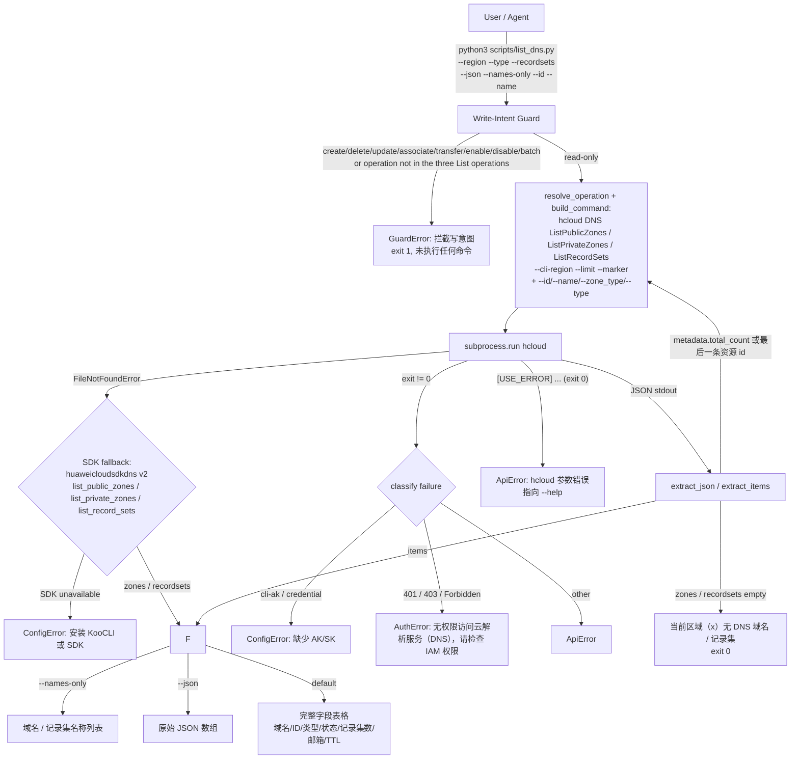

# Data Flow Diagram

```mermaid
flowchart TD
    A[User / Agent] -->|"python3 scripts/list_dns.py<br/>--region --type --recordsets<br/>--json --names-only --id --name"| B[Write-Intent Guard]
    B -->|"create/delete/update/associate/transfer/enable/disable/batch<br/>or operation not in the three List operations"| G[GuardError: 拦截写意图<br/>exit 1, 未执行任何命令]
    B -->|read-only| C["resolve_operation + build_command:<br/>hcloud DNS ListPublicZones / ListPrivateZones / ListRecordSets<br/>--cli-region --limit --marker<br/>+ --id/--name/--zone_type/--type"]
    C --> D[subprocess.run hcloud]
    D -->|FileNotFoundError| F1{SDK fallback:<br/>huaweicloudsdkdns v2<br/>list_public_zones / list_private_zones / list_record_sets}
    F1 -->|SDK unavailable| E1[ConfigError: 安装 KooCLI 或 SDK]
    F1 -->|zones / recordsets| F
    D -->|"exit != 0"| E2{classify failure}
    E2 -->|"cli-ak / credential"| E3[ConfigError: 缺少 AK/SK]
    E2 -->|"401 / 403 / Forbidden"| E4[AuthError: 无权限访问云解析服务（DNS），请检查 IAM 权限]
    E2 -->|"other"| E5[ApiError]
    D -->|"[USE_ERROR] ... (exit 0)"| E6[ApiError: hcloud 参数错误<br/>指向 --help]
    D -->|JSON stdout| F2[extract_json / extract_items]
    F2 -->|"zones / recordsets empty"| H["当前区域（x）无 DNS 域名 / 记录集<br/>exit 0"]
    F2 -->|items| F
    F -->|--names-only| J[域名 / 记录集名称列表]
    F -->|--json| K[原始 JSON 数组]
    F -->|default| L[完整字段表格<br/>域名/ID/类型/状态/记录集数/邮箱/TTL]
    F2 -->|"metadata.total_count 或最后一条资源 id"| C
```