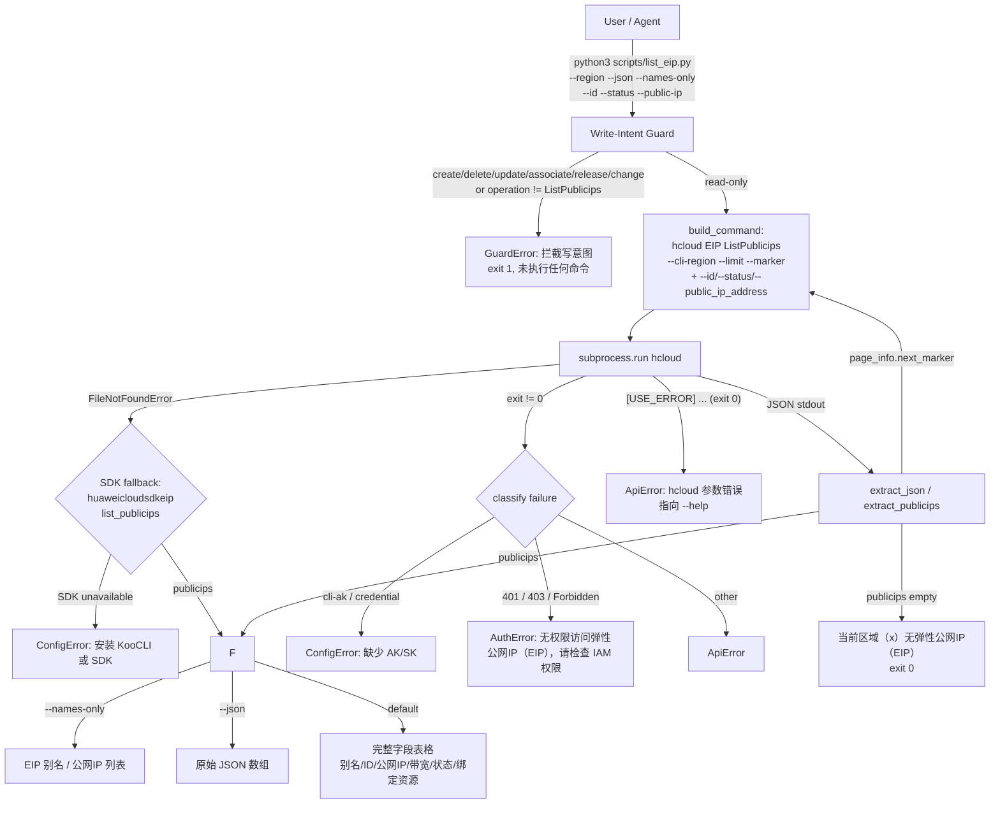

# Data Flow Diagram

```mermaid
flowchart TD
    A[User / Agent] -->|"python3 scripts/list_eip.py<br/>--region --json --names-only<br/>--id --status --public-ip"| B[Write-Intent Guard]
    B -->|"create/delete/update/associate/release/change<br/>or operation != ListPublicips"| G[GuardError: 拦截写意图<br/>exit 1, 未执行任何命令]
    B -->|read-only| C[build_command:<br/>hcloud EIP ListPublicips<br/>--cli-region --limit --marker<br/>+ --id/--status/--public_ip_address]
    C --> D[subprocess.run hcloud]
    D -->|FileNotFoundError| F1{SDK fallback:<br/>huaweicloudsdkeip<br/>list_publicips}
    F1 -->|SDK unavailable| E1[ConfigError: 安装 KooCLI 或 SDK]
    F1 -->|publicips| F
    D -->|"exit != 0"| E2{classify failure}
    E2 -->|"cli-ak / credential"| E3[ConfigError: 缺少 AK/SK]
    E2 -->|"401 / 403 / Forbidden"| E4[AuthError: 无权限访问弹性公网IP（EIP），请检查 IAM 权限]
    E2 -->|"other"| E5[ApiError]
    D -->|"[USE_ERROR] ... (exit 0)"| E6[ApiError: hcloud 参数错误<br/>指向 --help]
    D -->|JSON stdout| F2[extract_json / extract_publicips]
    F2 -->|"publicips empty"| H["当前区域（x）无弹性公网IP（EIP）<br/>exit 0"]
    F2 -->|publicips| F
    F -->|--names-only| J[EIP 别名 / 公网IP 列表]
    F -->|--json| K[原始 JSON 数组]
    F -->|default| L[完整字段表格<br/>别名/ID/公网IP/带宽/状态/绑定资源]
    F2 -->|"page_info.next_marker"| C
```