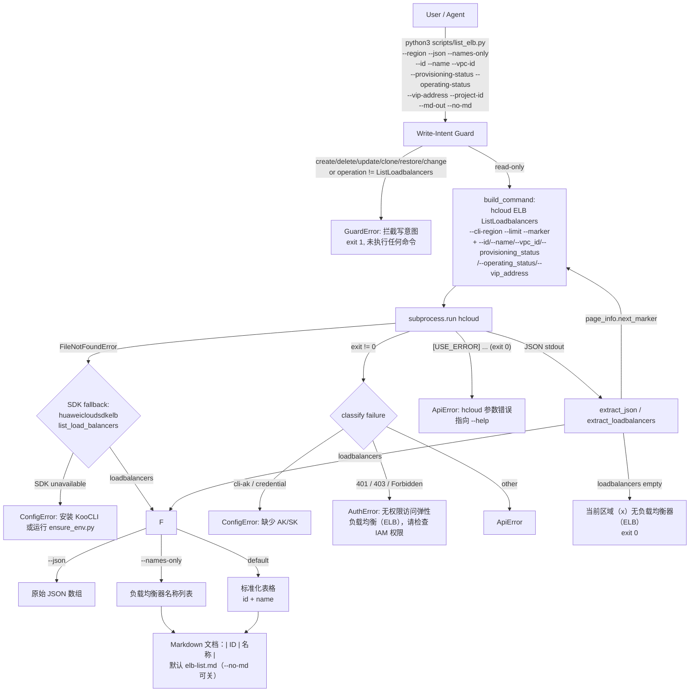

# Data Flow Diagram

```mermaid
flowchart TD
    A[User / Agent] -->|"python3 scripts/list_elb.py<br/>--region --json --names-only<br/>--id --name --vpc-id<br/>--provisioning-status --operating-status<br/>--vip-address --project-id<br/>--md-out --no-md"| B[Write-Intent Guard]
    B -->|"create/delete/update/clone/restore/change<br/>or operation != ListLoadbalancers"| G[GuardError: 拦截写意图<br/>exit 1, 未执行任何命令]
    B -->|read-only| C[build_command:<br/>hcloud ELB ListLoadbalancers<br/>--cli-region --limit --marker<br/>+ --id/--name/--vpc_id/--provisioning_status<br/>/--operating_status/--vip_address]
    C --> D[subprocess.run hcloud]
    D -->|FileNotFoundError| F1{SDK fallback:<br/>huaweicloudsdkelb<br/>list_load_balancers}
    F1 -->|SDK unavailable| E1[ConfigError: 安装 KooCLI 或运行 ensure_env.py]
    F1 -->|loadbalancers| F
    D -->|"exit != 0"| E2{classify failure}
    E2 -->|"cli-ak / credential"| E3[ConfigError: 缺少 AK/SK]
    E2 -->|"401 / 403 / Forbidden"| E4[AuthError: 无权限访问弹性负载均衡（ELB），请检查 IAM 权限]
    E2 -->|"other"| E5[ApiError]
    D -->|"[USE_ERROR] ... (exit 0)"| E6[ApiError: hcloud 参数错误<br/>指向 --help]
    D -->|JSON stdout| F2[extract_json / extract_loadbalancers]
    F2 -->|"loadbalancers empty"| H["当前区域（x）无负载均衡器（ELB）<br/>exit 0"]
    F2 -->|loadbalancers| F
    F -->|--json| K[原始 JSON 数组]
    F -->|--names-only| J[负载均衡器名称列表]
    F -->|default| L[标准化表格<br/>id + name]
    J --> M["Markdown 文档：| ID | 名称 |<br/>默认 elb-list.md（--no-md 可关）"]
    L --> M
    F2 -->|"page_info.next_marker"| C
```