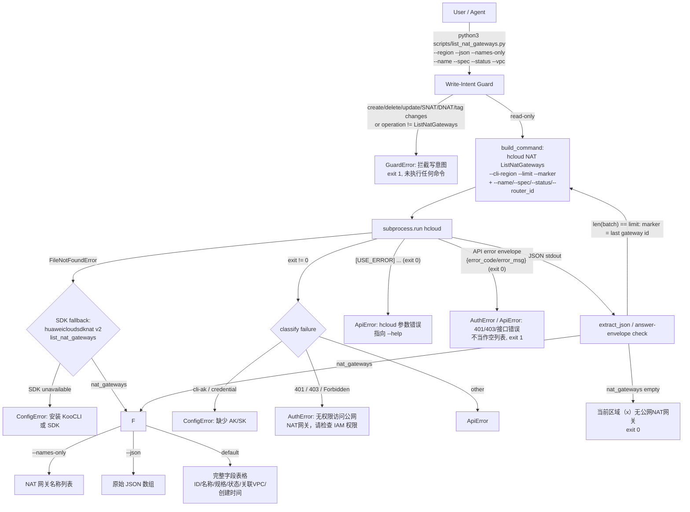

# Data Flow Diagram

```mermaid
flowchart TD
    A[User / Agent] -->|"python3 scripts/list_nat_gateways.py<br/>--region --json --names-only<br/>--name --spec --status --vpc"| B[Write-Intent Guard]
    B -->|"create/delete/update/SNAT/DNAT/tag changes<br/>or operation != ListNatGateways"| G[GuardError: 拦截写意图<br/>exit 1, 未执行任何命令]
    B -->|read-only| C[build_command:<br/>hcloud NAT ListNatGateways<br/>--cli-region --limit --marker<br/>+ --name/--spec/--status/--router_id]
    C --> D[subprocess.run hcloud]
    D -->|FileNotFoundError| F1{SDK fallback:<br/>huaweicloudsdknat v2<br/>list_nat_gateways}
    F1 -->|SDK unavailable| E1[ConfigError: 安装 KooCLI 或 SDK]
    F1 -->|nat_gateways| F
    D -->|"exit != 0"| E2{classify failure}
    E2 -->|"cli-ak / credential"| E3[ConfigError: 缺少 AK/SK]
    E2 -->|"401 / 403 / Forbidden"| E4[AuthError: 无权限访问公网NAT网关，请检查 IAM 权限]
    E2 -->|other| E5[ApiError]
    D -->|"[USE_ERROR] ... (exit 0)"| E6[ApiError: hcloud 参数错误<br/>指向 --help]
    D -->|"API error envelope<br/>{error_code/error_msg} (exit 0)"| E7[AuthError / ApiError: 401/403/接口错误<br/>不当作空列表, exit 1]
    D -->|JSON stdout| F2[extract_json / answer-envelope check]
    F2 -->|"nat_gateways empty"| H["当前区域（x）无公网NAT网关<br/>exit 0"]
    F2 -->|nat_gateways| F
    F -->|--names-only| J[NAT 网关名称列表]
    F -->|--json| K[原始 JSON 数组]
    F -->|default| L[完整字段表格<br/>ID/名称/规格/状态/关联VPC/创建时间]
    F2 -->|"len(batch) == limit: marker = last gateway id"| C
```
