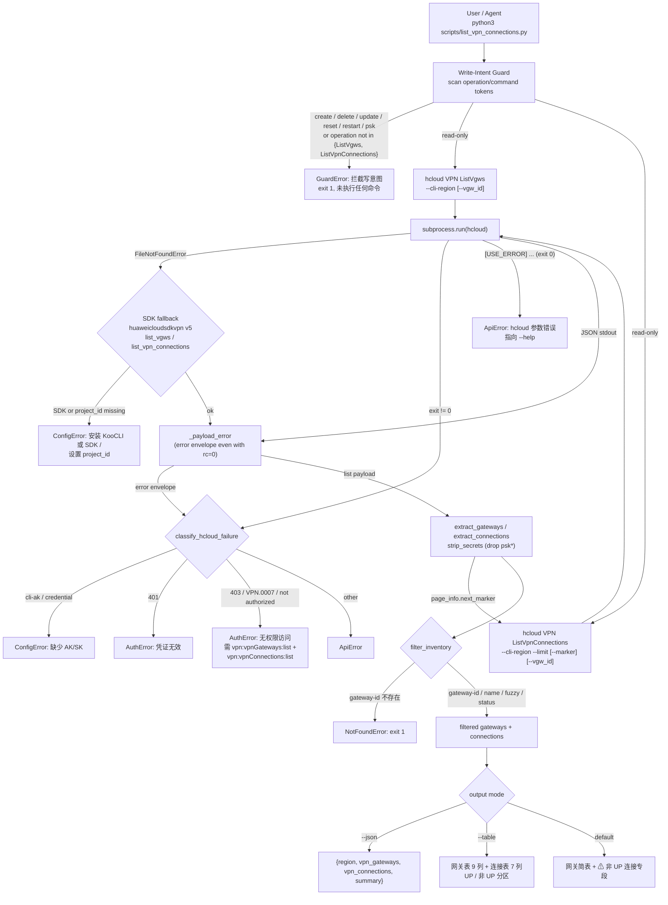

# Data Flow Diagram

```mermaid
flowchart TD
    A["User / Agent<br/>python3 scripts/list_vpn_connections.py"] --> B["Write-Intent Guard<br/>scan operation/command tokens"]
    B -->|"create / delete / update / reset / restart / psk<br/>or operation not in {ListVgws, ListVpnConnections}"| G["GuardError: 拦截写意图<br/>exit 1, 未执行任何命令"]
    B -->|"read-only"| C1["hcloud VPN ListVgws<br/>--cli-region [--vgw_id]"]
    B -->|"read-only"| C2["hcloud VPN ListVpnConnections<br/>--cli-region --limit [--marker] [--vgw_id]"]
    C1 --> D["subprocess.run(hcloud)"]
    C2 --> D
    D -->|"FileNotFoundError"| F1{"SDK fallback<br/>huaweicloudsdkvpn v5<br/>list_vgws / list_vpn_connections"}
    F1 -->|"SDK or project_id missing"| E1["ConfigError: 安装 KooCLI 或 SDK /<br/>设置 project_id"]
    F1 -->|"ok"| P
    D -->|"exit != 0"| E2{"classify_hcloud_failure"}
    E2 -->|"cli-ak / credential"| E3["ConfigError: 缺少 AK/SK"]
    E2 -->|"401"| E4["AuthError: 凭证无效"]
    E2 -->|"403 / VPN.0007 / not authorized"| E5["AuthError: 无权限访问<br/>需 vpn:vpnGateways:list +<br/>vpn:vpnConnections:list"]
    E2 -->|"other"| E6["ApiError"]
    D -->|"[USE_ERROR] ... (exit 0)"| E7["ApiError: hcloud 参数错误<br/>指向 --help"]
    D -->|"JSON stdout"| P["_payload_error<br/>(error envelope even with rc=0)"]
    P -->|"error envelope"| E2
    P -->|"list payload"| F["extract_gateways / extract_connections<br/>strip_secrets (drop psk*)"]
    F -->|"page_info.next_marker"| C2
    F --> H{"filter_inventory"}
    H -->|"gateway-id 不存在"| H1["NotFoundError: exit 1"]
    H -->|"gateway-id / name / fuzzy / status"| I["filtered gateways + connections"]
    I --> J{"output mode"}
    J -->|"--json"| K["{region, vpn_gateways, vpn_connections, summary}"]
    J -->|"--table"| L["网关表 9 列 + 连接表 7 列<br/>UP / 非 UP 分区"]
    J -->|"default"| M["网关简表 + ⚠ 非 UP 连接专段"]
```