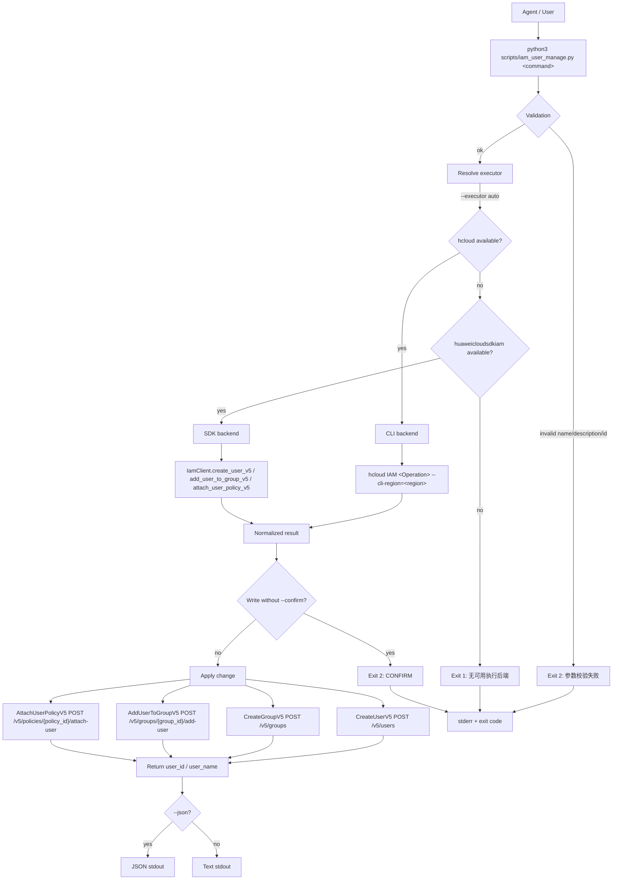
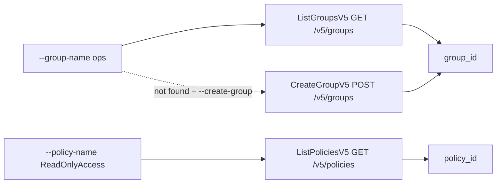

# Data Flow Diagram

```mermaid
flowchart TD
    A[Agent / User] --> B["python3 scripts/iam_user_manage.py &lt;command&gt;"]
    B --> C{Validation}
    C -->|invalid name/description/id| C1[Exit 2: 参数校验失败]
    C -->|ok| D[Resolve executor]

    D -->|--executor auto| E{hcloud available?}
    E -->|yes| F[CLI backend]
    E -->|no| G{huaweicloudsdkiam available?}
    G -->|yes| H[SDK backend]
    G -->|no| G1[Exit 1: 无可用执行后端]

    F --> I["hcloud IAM &lt;Operation&gt; --cli-region=&lt;region&gt;"]
    H --> J["IamClient.create_user_v5 / add_user_to_group_v5 / attach_user_policy_v5"]

    I --> K[Normalized result]
    J --> K
    K --> L{Write without --confirm?}
    L -->|yes| L1[Exit 2: CONFIRM]
    L -->|no| M[Apply change]

    M --> N["CreateUserV5 POST /v5/users"]
    M --> O["CreateGroupV5 POST /v5/groups"]
    M --> P["AddUserToGroupV5 POST /v5/groups/{group_id}/add-user"]
    M --> Q["AttachUserPolicyV5 POST /v5/policies/{policy_id}/attach-user"]

    N --> R[Return user_id / user_name]
    O --> R
    P --> R
    Q --> R
    R --> S{--json?}
    S -->|yes| T[JSON stdout]
    S -->|no| U[Text stdout]

    C1 --> Z[stderr + exit code]
    G1 --> Z
    L1 --> Z
```

Read-only name resolution used by `--group-name` / `--policy-name`:

```mermaid
flowchart LR
    GN["--group-name ops"] --> LG["ListGroupsV5 GET /v5/groups"] --> GID[group_id]
    PN["--policy-name ReadOnlyAccess"] --> LP["ListPoliciesV5 GET /v5/policies"] --> PID[policy_id]
    GN -.not found + --create-group.-> CG["CreateGroupV5 POST /v5/groups"] --> GID
```