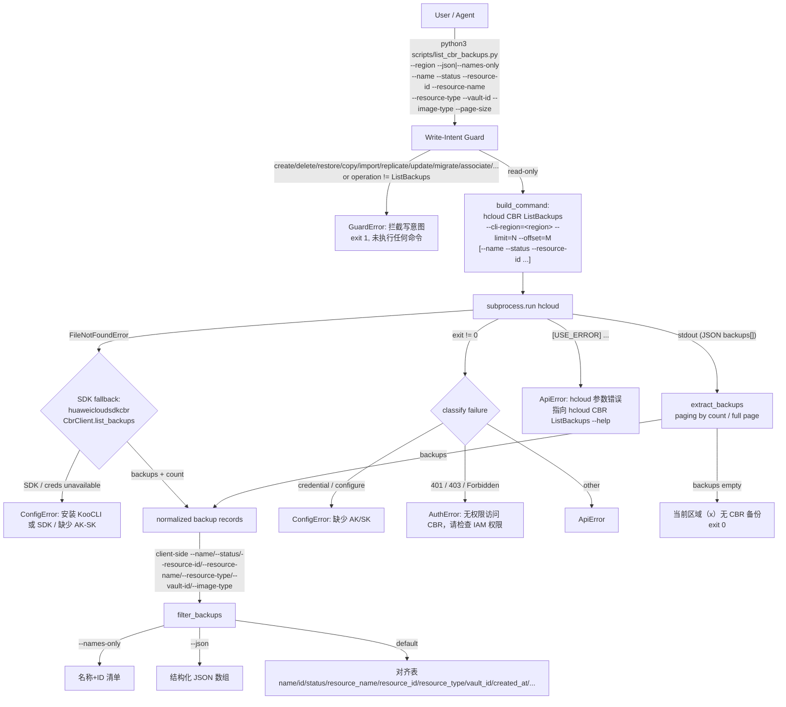
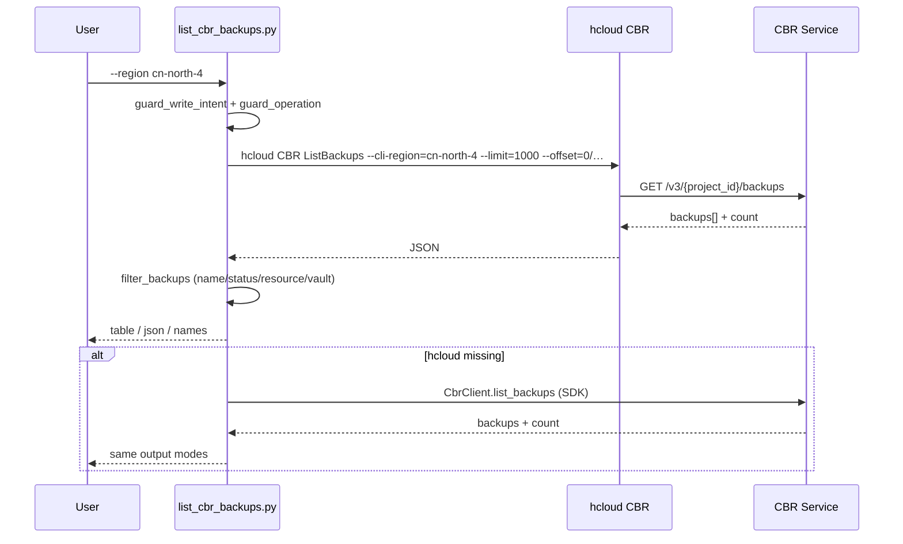

# Data Flow Diagram

```mermaid
flowchart TD
    A[User / Agent] -->|"python3 scripts/list_cbr_backups.py<br/>--region --json|--names-only<br/>--name --status --resource-id --resource-name<br/>--resource-type --vault-id --image-type --page-size"| B[Write-Intent Guard]
    B -->|"create/delete/restore/copy/import/replicate/update/migrate/associate/...<br/>or operation != ListBackups"| G[GuardError: 拦截写意图<br/>exit 1, 未执行任何命令]
    B -->|read-only| C["build_command:<br/>hcloud CBR ListBackups<br/>--cli-region=&lt;region&gt; --limit=N --offset=M<br/>[--name --status --resource-id ...]"]
    C --> D[subprocess.run hcloud]
    D -->|FileNotFoundError| F1{SDK fallback:<br/>huaweicloudsdkcbr<br/>CbrClient.list_backups}
    F1 -->|"SDK / creds unavailable"| E1[ConfigError: 安装 KooCLI 或 SDK / 缺少 AK-SK]
    F1 -->|backups + count| F
    D -->|"exit != 0"| E2{classify failure}
    E2 -->|"credential / configure"| E3[ConfigError: 缺少 AK/SK]
    E2 -->|"401 / 403 / Forbidden"| E4[AuthError: 无权限访问 CBR，请检查 IAM 权限]
    E2 -->|"other"| E5[ApiError]
    D -->|"[USE_ERROR] ..."| E6[ApiError: hcloud 参数错误<br/>指向 hcloud CBR ListBackups --help]
    D -->|"stdout (JSON backups[])"| F2[extract_backups<br/>paging by count / full page]
    F2 -->|"backups empty"| H["当前区域（x）无 CBR 备份<br/>exit 0"]
    F2 -->|backups| F[normalized backup records]
    F -->|"client-side --name/--status/--resource-id/--resource-name/--resource-type/--vault-id/--image-type"| F3[filter_backups]
    F3 -->|--names-only| J[名称+ID 清单]
    F3 -->|--json| K[结构化 JSON 数组]
    F3 -->|default| L[对齐表<br/>name/id/status/resource_name/resource_id/resource_type/vault_id/created_at/...]
```

## Sequence (CLI primary)

```mermaid
sequenceDiagram
    participant U as User
    participant P as list_cbr_backups.py
    participant C as hcloud CBR
    participant O as CBR Service
    U->>P: --region cn-north-4
    P->>P: guard_write_intent + guard_operation
    P->>C: hcloud CBR ListBackups --cli-region=cn-north-4 --limit=1000 --offset=0/…
    C->>O: GET /v3/{project_id}/backups
    O-->>C: backups[] + count
    C-->>P: JSON
    P->>P: filter_backups (name/status/resource/vault)
    P-->>U: table / json / names

    alt hcloud missing
        P->>O: CbrClient.list_backups (SDK)
        O-->>P: backups + count
        P-->>U: same output modes
    end
```