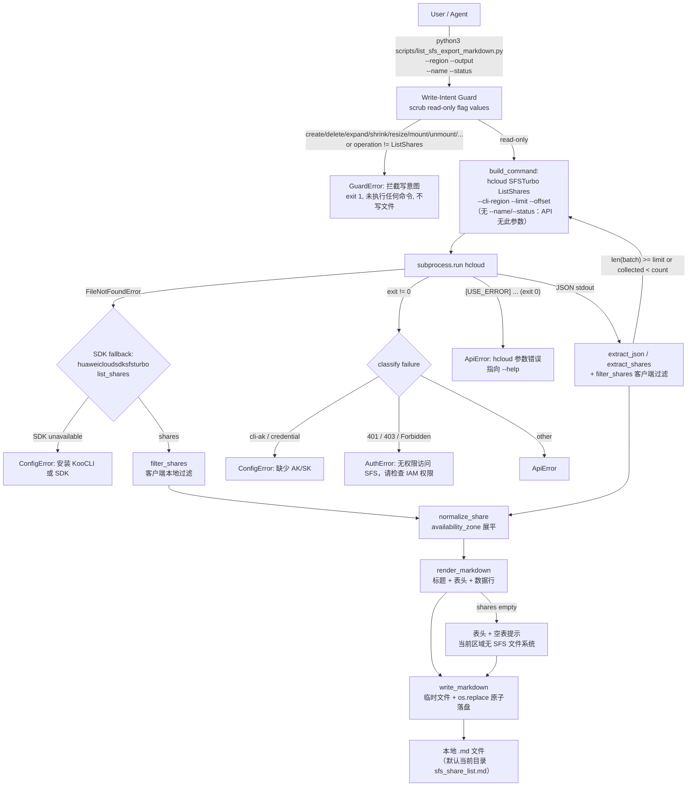

# Data Flow Diagram

```mermaid
flowchart TD
    A[User / Agent] -->|"python3 scripts/list_sfs_export_markdown.py<br/>--region --output<br/>--name --status"| B[Write-Intent Guard<br/>scrub read-only flag values]
    B -->|"create/delete/expand/shrink/resize/mount/unmount/...<br/>or operation != ListShares"| G[GuardError: 拦截写意图<br/>exit 1, 未执行任何命令, 不写文件]
    B -->|read-only| C[build_command:<br/>hcloud SFSTurbo ListShares<br/>--cli-region --limit --offset<br/>（无 --name/--status：API 无此参数）]
    C --> D[subprocess.run hcloud]
    D -->|FileNotFoundError| F1{SDK fallback:<br/>huaweicloudsdksfsturbo<br/>list_shares}
    F1 -->|SDK unavailable| E1[ConfigError: 安装 KooCLI 或 SDK]
    F1 -->|shares| FS[filter_shares<br/>客户端本地过滤]
    FS --> F
    D -->|"exit != 0"| E2{classify failure}
    E2 -->|"cli-ak / credential"| E3[ConfigError: 缺少 AK/SK]
    E2 -->|"401 / 403 / Forbidden"| E4[AuthError: 无权限访问 SFS，请检查 IAM 权限]
    E2 -->|"other"| E5[ApiError]
    D -->|"[USE_ERROR] ... (exit 0)"| E6[ApiError: hcloud 参数错误<br/>指向 --help]
    D -->|JSON stdout| F2[extract_json / extract_shares<br/>+ filter_shares 客户端过滤]
    F2 -->|"len(batch) >= limit or collected < count"| C
    F2 --> F[normalize_share<br/>availability_zone 展平]
    F --> R[render_markdown<br/>标题 + 表头 + 数据行]
    R -->|shares empty| H["表头 + 空表提示<br/>当前区域无 SFS 文件系统"]
    R --> W[write_markdown<br/>临时文件 + os.replace 原子落盘]
    H --> W
    W --> O["本地 .md 文件<br/>（默认当前目录 sfs_share_list.md）"]
```

No branch in this diagram writes to Huawei Cloud: the only cloud call is the
read-only `ListShares` GET; the `.md` file is produced on the local filesystem
only.